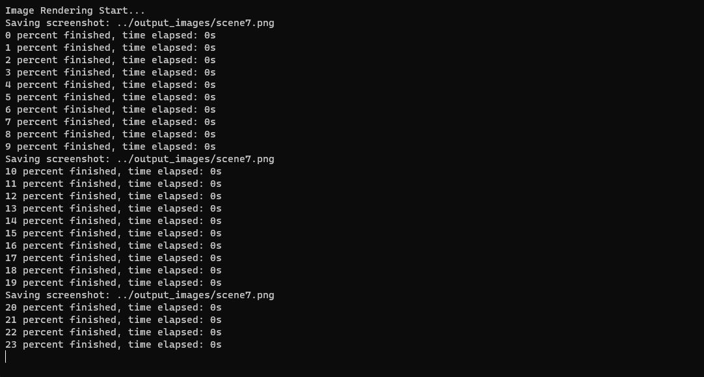
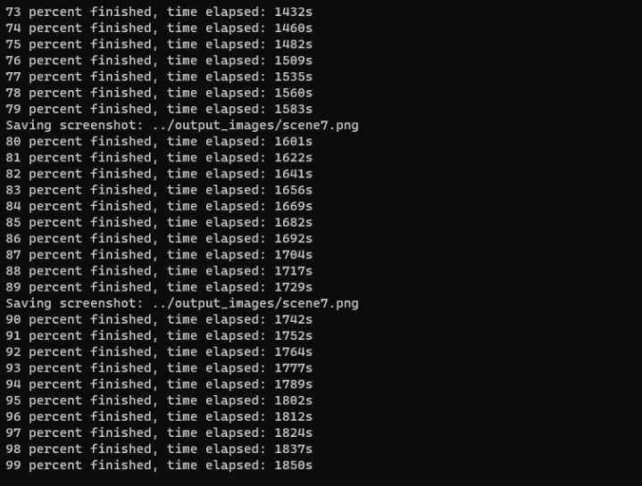
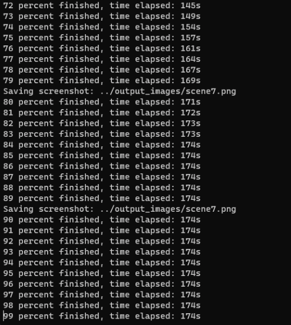

# CSE167HW4-Acceleration Structure

> This page only serves as a guide to our program. No code will be posted here.

# Run the code

> This program will run on Windows computers, Visual Studio 2022 worked for us.
> 1. Open the `.sln` file in the folder
> 2. Enter the `[filename].test` file to render in Visual Studio.
> 3. Click the green arrow on the top of Visual Studio, run with `Release` is suggested.
> 4. Then the program will start rendering.

> When the rendering finishes, images will be created in the folder "output_images". The output filename will be the same as the input filename (only .test changes to .png).
> For example, if we want to generate image for "scene1.test", put this file into the folder "tests", and put "scene1.test" as the only compilation argument. Run by clicking the green arrow, wait a few seconds, and "scene1.png" will appear in "output_images".

# Explanation
> We implemented bounding boxes for the acceleration stucture. We first created a cuboid that wraps all objects in the scene, then divide the cuboid into smaller cubes. We also calculated the wrapping cuboid for every triangle and sphere, then found where they are in the scene cuboid. When we have an incoming ray, we now only need to consider the traingles and spheres inside the cuboids intersected along the way, which can be calculated efficiently.

# Results
> After implementing this acceleration structure, we successfully sped up the rendering time of `scene7.test` from `30 - 40 minutes` to only `3 minutes`.

> Before Acceleration

> After Acceleration

Kevin Liu, Yuan Gao
